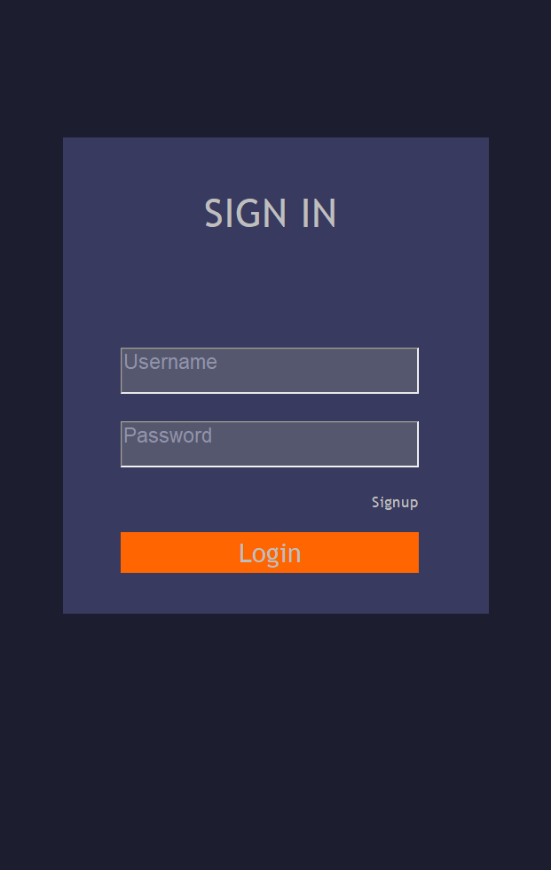
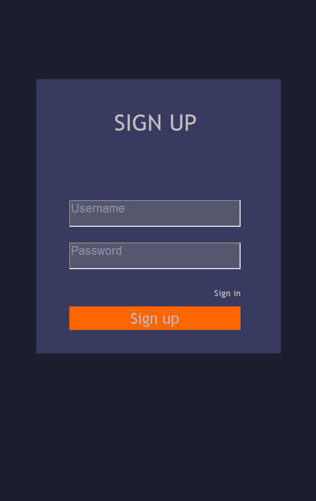
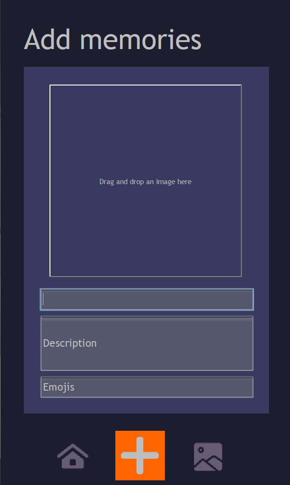
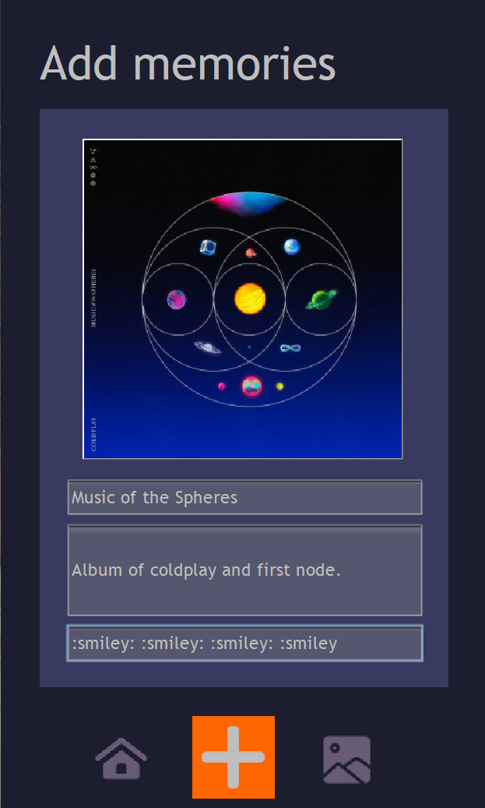
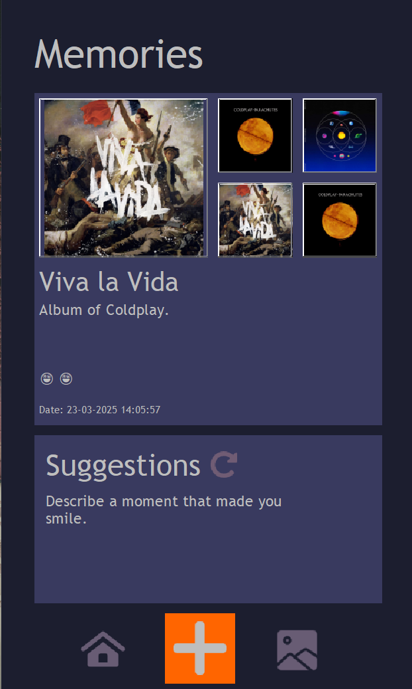
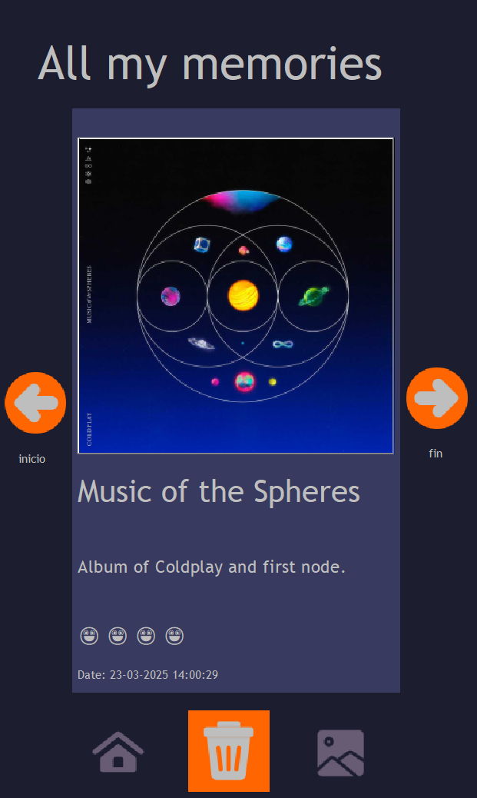

<h1>Memora</h1>

  
<strong>Memora</strong> is a simple app built for storing and organizing your personal memories. You can add images, titles, descriptions, and emojis, making it a fun way to keep track of your moments. This project is developed as a school project using circular doubly linked lists for efficient memory storage.

  <h2>🚀 Features</h2>
  <ul>
    <li><strong>Drag and Drop</strong>: Easily add images to the app with drag-and-drop functionality using the <strong>DND package</strong>.</li>
    <li><strong>Emoji Parsing</strong>: Thanks to <strong>Vincent DURMONT's library</strong>, we can parse emoji aliases (e.g., <code>:smile:</code>) to their actual emoji representation! 🎉</li>
    <li><strong>Memory Management</strong>: Store memories with images, titles, descriptions, emojis, and the date.</li>
    <li><strong>Circular Doubly Linked List</strong>: All memories are stored in a circular doubly linked list for efficient retrieval and organization.</li>
  </ul>

   <h2>📸 Screenshots</h2>
  
Here's a glimpse of how the app works:

  <!-- Sign In Screenshot -->
  <figure>
    
    <figcaption>Sign In screen where users can log into their account.</figcaption>
  </figure>

  <!-- Sign Up Screenshot -->
  <figure>
    
    <figcaption>Sign Up screen where users can create a new account.</figcaption>
  </figure>

  <!-- Add Memories Screenshots -->
  <figure>
    
    <figcaption>Add Memories screen where users can drag and drop images, add titles, descriptions, and emojis by their aliases.</figcaption>
  </figure>

  <figure>
    
    <figcaption>Another view of the Add Memories screen with image drag-and-drop and emoji alias input.</figcaption>
  </figure>

  <!-- Memories Screen (Last 5 Nodes) -->
  <figure>
    
    <figcaption>View the last 5 memories with a "Life" type node and a random suggestion from the list.</figcaption>
  </figure>

  <!-- All Memories Screen -->
  <figure>
    
    <figcaption>View all added memories, with options to delete nodes, go to next/previous images, and jump to the beginning/end.</figcaption>
  </figure>

  <h2>🐞 Known Issues</h2>
  
Please note, there are a few features that aren't yet fully implemented, but they are not bugs—just missing functionality for now:

  <ul>
    <li><strong>User Management</strong>: The system would allow each user to have their own set of memories stored securely.</li>
    <li><strong>Memory Filtering</strong>: Right now, all memories from different users are shown. In the future, we plan to filter memories by the user, so you’ll only see your own memories in the app.</li>
  </ul>

  <h2>🛠️ Technologies Used</h2>
  <ul>
    <li><strong>DND Package</strong>: For drag-and-drop functionality to add images seamlessly.</li>
    <li><strong>Vincent DURMONT's Emoji Parser</strong>: To turn emoji aliases into actual emojis. <a href="https://github.com/vdurmont/emoji-java">Library link here</a></li>
    <li><strong>Circular Doubly Linked List</strong>: For efficient memory storage</li>
  </ul>

  <h2>🙌 Credits</h2>
  <ul>
    <li>Special thanks to <strong>Vincent DURMONT</strong> for the library that makes emoji parsing possible!</li>
  </ul>
